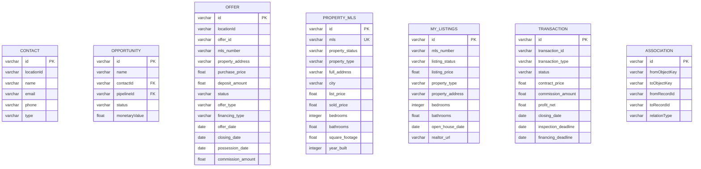

# SECTION 6 — ERD Description
## 6.0 — ERD Design Notes
Format Inventory
This section delivers four interoperable ERD formats — use whichever fits your toolchain:

| Format | Section | Best For | How to Use |
| --- | --- | --- | --- |
| DBML | 6.2 | dbdiagram.io | Paste directly at dbdiagram.io → auto-renders |
| Mermaid — Core CRM | 6.3 | GitHub, Notion, Obsidian, VS Code | Paste into any Mermaid renderer |
| Mermaid — Real Estate Custom Objects | 6.4 | GitHub, Notion | Paste into Mermaid renderer |
| Mermaid — Commerce & Memberships | 6.5 | GitHub, Notion | Paste into Mermaid renderer |
| Entity Box Reference | 6.6 | Lucidchart, Draw.io (manual) | Use as copy-paste reference when building manually |

Cardinality Key Used Throughout
| Notation | DBML | Mermaid | Meaning |
| --- | --- | --- | --- |
| One-to-Many | > | ||--o{ | One parent, many children |
| Many-to-One | < | }o--|| | Many children, one parent |
| Many-to-Many | >< | }o--o{ | Freely linked both directions |
| One-to-One | - | ||--|| | Exactly one on each side |
| Zero-or-one | o- | ||--o| | Optional single |

## 6.1 — Recommended Visual Layout (Diagram Zone Map)
When rendering in Lucidchart or Draw.io, use this 7-zone spatial layout to keep the diagram readable:

┌──────────────────────────────────────────────────────────────────────┐
│  ZONE 1: CORE CRM                │  ZONE 2: REAL ESTATE CUSTOM OBJECTS│
│                                  │                                    │
│  Company ── Contact ── User      │  Offer ── Property MLS             │
│               │                  │    │          │                    │
│           Opportunity             │  My Listings  Transaction          │
│               │                  │                                    │
│            Pipeline               │                                    │
│            └─ Stage               │                                    │
├──────────────────────────────────┼────────────────────────────────────┤
│  ZONE 3: ACTIVITIES              │  ZONE 4: CALENDAR & SCHEDULING     │
│                                  │                                    │
│  Task ── Contact                 │  Calendar Group                    │
│  Note ── Contact                 │       └── Calendar                 │
│  Appointment ─► Calendar         │               └── Appointment       │
│                                  │               └── Block Slot        │
├──────────────────────────────────┼────────────────────────────────────┤
│  ZONE 5: COMMUNICATIONS          │  ZONE 6: COMMERCE                  │
│                                  │                                    │
│  Conversation ─► Message         │  Product ─► Product Price          │
│  Form ─► Form Submission         │  Order ─► Fulfillment              │
│  Survey ─► Survey Submission     │  Invoice ─► Schedule               │
│  Workflow                        │  Coupon                            │
│  Campaign                        │                                    │
│  Trigger Link                    │                                    │
├──────────────────────────────────┼────────────────────────────────────┤
│  ZONE 7: CONFIGURATION & SUPPORT                                      │
│  Custom Field ── Folder │ Custom Value │ Media File ── Folder         │
│  Membership Offer ── Course ── Category ── Lesson ── Access           │
│  Review │ Review Request │ Document ── Template │ Snapshot            │
└──────────────────────────────────────────────────────────────────────┘
## 6.2 — DBML — Full Schema (dbdiagram.io)
Usage: Go to dbdiagram.io → click Import or paste directly into the editor. The full ERD will auto-render with all 57 tables and relationship lines.

```dbml
// ==========================================================
// CRM Sub-Account — Complete DBML Schema
// Account: Real Estate Pro CRM - Dev | Lethbridge, AB, CA
// Generated: 2026-07-01 | 57 tables | 105+ relationships
// Paste directly into dbdiagram.io
// ==========================================================

// ──────────────────────────────────────
// ZONE 1 — CORE CRM
// ──────────────────────────────────────

Table contact {
| id | varchar | [pk, note: "24-char ObjectId"] |
| --- | --- | --- |
| locationId | varchar | [not null, note: "Sub-account partition key"] |
| firstName | varchar |  |
| lastName | varchar |  |
| name | varchar | [note: "Computed: firstName + lastName"] |
| email | varchar |  |
| emailLowerCase | varchar | [note: "Indexed for dedup"] |
| phone | varchar |  |
| mobile | varchar |  |
| address1 | varchar |  |
| address2 | varchar |  |
| city | varchar |  |
| state | varchar |  |
| country | varchar |  |
| postalCode | varchar |  |
| timezone | varchar |  |
| companyName | varchar |  |
| website | varchar |  |
| dob | date |  |
| gender | varchar | [note: "male|female|other|prefer_not_to_say|unknown"] |
| type | varchar | [default: "lead", note: "lead|customer"] |
| source | varchar |  |
| assignedTo | varchar | [ref: > user.id] |
| businessId | varchar | [ref: > business.id] |
| businessName | varchar | [note: "Denorm from business"] |
| dnd | boolean | [default: false] |
| dndSettings | json | [note: "Per-channel: Call|Email|SMS|WhatsApp|GMB|FB"] |

  inboundDndActive boolean
| tags | varchar[] |
| --- | --- |
| customFields | json[] |
| followers | varchar[] |

  additionalEmails varchar[]
  additionalPhones json[]
| keyword | varchar |
| --- | --- |
| medium | varchar |
| attributionSource json | [note: "UTM + traffic attribution"] |
| contactScore | integer |
| lastActivity | timestamp |

  dateOfLastAppointment timestamp
  firstSessionActivityAt timestamp
  lastSessionActivityAt timestamp
| dateAdded | timestamp |
| --- | --- |
| dateUpdated | timestamp |

}
```

Table business {
| id | varchar | [pk] |
| --- | --- | --- |
| locationId | varchar | [not null] |
| name | varchar | [not null] |
| email | varchar |  |
| phone | varchar |  |
| address | varchar |  |
| city | varchar |  |
| state | varchar |  |
| country | varchar |  |
| postalCode | varchar |  |
| website | varchar |  |

  description text
| revenue | float |
| --- | --- |
| employees | integer |
| industry | varchar |

  customFields json[]
| dateAdded | timestamp |
| --- | --- |

  dateUpdated timestamp
}

Table opportunity {
| id | varchar | [pk] |
| --- | --- | --- |
| locationId | varchar | [not null] |
| name | varchar | [not null] |
| pipelineId | varchar | [not null, ref: > pipeline.id] |
| pipelineStageId | varchar | [not null, ref: > pipeline_stage.id] |
| contactId | varchar | [not null, ref: > contact.id] |
| assignedTo | varchar | [ref: > user.id] |
| status | varchar | [default: "open", note: "open|won|lost|abandoned"] |
| monetaryValue | float |  |
| source | varchar |  |
| lostReason | varchar |  |
| tags | varchar[] |  |
| followers | varchar[] [note: "Array of user.id"] |  |
| contactName | varchar | [note: "Denorm"] |
| contactEmail | varchar | [note: "Denorm"] |
| contactPhone | varchar | [note: "Denorm"] |
| businessName | varchar | [note: "Denorm"] |
| customFields | json[] |  |

  lastStageChangeAt timestamp
  lastStatusChangeAt timestamp
| dateAdded | timestamp |
| --- | --- |
| dateUpdated | timestamp |

}

Table pipeline {
| id | varchar | [pk] |
| --- | --- | --- |
| locationId | varchar | [not null] |
| name | varchar | [not null] |
| dateAdded | timestamp |  |

  dateUpdated timestamp
}

Table pipeline_stage {
| id | varchar | [pk] |
| --- | --- | --- |
| pipelineId | varchar | [not null, ref: > pipeline.id] |
| name | varchar | [not null] |
| position | integer | [not null] |
| showInFunnel | boolean | [default: true] |
| showInPieChart boolean | [default: true] |  |

}

Table user {
| id | varchar | [pk] |
| --- | --- | --- |
| locationId | varchar | [not null] |
| firstName | varchar | [not null] |
| lastName | varchar | [not null] |
| name | varchar |  |
| email | varchar | [not null, unique] |
| phone | varchar |  |
| extension | varchar |  |
| role | varchar | [default: "user", note: "admin|user"] |
| permissions | json |  |

  profilePhoto varchar
| calendarId | varchar | [ref: > calendar.id] |
| --- | --- | --- |
| timezone | varchar |  |
| type | varchar | [note: "account|agency"] |
| isActive | boolean | [default: true] |
| dateAdded | timestamp |  |
| dateUpdated | timestamp |  |

}

// ──────────────────────────────────────
// ZONE 2 — REAL ESTATE CUSTOM OBJECTS
// ──────────────────────────────────────

Table offer {
| id | varchar | [pk, note: "objectRecords._id"] |
| --- | --- | --- |
| locationId | varchar | [not null] |
| objectKey | varchar | [default: "custom_objects.real_estate_offer"] |
| offer_id | varchar | [not null, note: "R | Primary display"] |
| property_address | varchar |  |
| mls_number | varchar |  |
| legal_description | text |  |
| purchase_price | float |  |
| deposit_amount | float |  |
| additional_deposit | float |  |
| counter_price | float |  |
| commission_amount | float |  |
| commission_split | varchar |  |
| status | varchar | [note: "pending|accepted|countered|rejected|closed|expired"] |
| offer_type | varchar | [note: "buyer_offer|seller_offer|counter_offer"] |
| financing_type | varchar | [note: "conventional|cmhc_insured|cash|private|other"] |
| offer_date | date |  |
| expiry_date | date |  |
| possession_date | date |  |
| closing_date | date |  |
| conditions_deadline | date |  |
| conditions | text |  |
| contingencies | text |  |
| terms_conditions | text |  |
| included_chattels | text |  |
| excluded_fixtures | text |  |
| notes | text |  |
| submitted_by | varchar |  |
| documents_ref | varchar |  |
| dateAdded | timestamp |  |
| dateUpdated | timestamp |  |

}

Table property_mls {
| id | varchar | [pk, note: "objectRecords._id"] |
| --- | --- | --- |
| locationId | varchar | [not null] |
| objectKey | varchar | [default: "custom_objects.properties"] |
| mls | varchar | [not null, unique, note: "R | U | Primary display"] |
| property_name | varchar |  |
| property_status | varchar | [note: "active|pending|sold|expired|withdrawn|coming_soon"] |
| property_type | varchar | [note: "single_family|condo|townhouse|multifamily|land|commercial"] |
| sub_type | varchar | [note: "detached|semi_detached|row_house|stacked|suite|other"] |
| full_address | varchar |  |
| city | varchar |  |
| province | varchar |  |
| postal | varchar |  |
| latitude | float |  |
| longitude | float |  |
| list_price | float |  |
| sold_price | float |  |
| condo_fees | float |  |
| tax_assessment | float |  |
| bedrooms | integer |  |
| bathrooms | float |  |
| square_footage | float |  |
| lot_size | float |  |
| year_built | integer |  |
| garage | varchar | [note: "none|single_attached|double_attached|..."] |
| basement | varchar | [note: "none|unfinished|partially_finished|fully_finished"] |
| heating_type | varchar | [note: "forced_air|baseboard|radiant|boiler|geothermal"] |
| features_amenities | text |  |
| listing_date | date |  |
| listing_expiry | date |  |
| sold_date | date |  |
| days_on_market | integer |  |
| listing_url | varchar |  |
| property_images | varchar | [note: "FILE_UPLOAD reference URL"] |
| property_notes | text |  |
| feature_highlights | text |  |
| documents_ref | varchar |  |
| dateAdded | timestamp |  |
| dateUpdated | timestamp |  |

}

Table my_listings {
| id | varchar | [pk, note: "objectRecords._id"] |
| --- | --- | --- |
| locationId | varchar | [not null] |
| objectKey | varchar | [default: "custom_objects.my_listings"] |
| mls_number | varchar | [not null, note: "R | Primary display"] |
| listing_key | varchar |  |
| listing_status | varchar | [note: "active|sold|expired|withdrawn|pending"] |
| listing_date | date |  |
| days_on_market | integer |  |
| listing_price | float |  |
| realtor_url | varchar |  |
| last_synced | date |  |
| notes | text |  |
| tags | varchar |  |
| property_address | varchar |  |
| city | varchar |  |
| province | varchar |  |
| postal_code | varchar |  |
| property_type | varchar | [note: "house|condo|townhouse|land|commercial"] |
| sub_type | varchar | [note: "detached|semi_detached|row_house|stacked|suite"] |
| bedrooms | integer |  |
| bathrooms | float |  |
| square_footage | float |  |
| lot_size | float |  |
| year_built | integer |  |
| photos_url | varchar |  |
| agent_name | varchar |  |
| brokerage | varchar |  |
| open_house_date | date |  |
| listing_description | text |  |
| dateAdded | timestamp |  |
| dateUpdated | timestamp |  |

}

Table transaction {
| id | varchar | [pk, note: "objectRecords._id"] |
| --- | --- | --- |
| locationId | varchar | [not null] |
| objectKey | varchar | [default: "custom_objects.transactions"] |
| transaction_id | varchar | [not null, note: "R | Primary display"] |
| transaction_type | varchar | [note: "sale|purchase|lease|referral"] |
| status | varchar | [note: "under_contract|pending|closed|cancelled|failed"] |
| brokerages | varchar |  |

  commission_split_details text
| post_transaction_notes | text |
| --- | --- |
| referral_source | varchar |
| documents_ref | varchar |
| contract_price | float |
| deposit_escrow | float |
| commission_amount | float |
| profit_net | float |
| commission_rate | float |
| closing_date | date |
| inspection_deadline | date |
| appraisal_date | date |
| financing_deadline | date |
| final_walkthrough | date |
| dateAdded | timestamp |
| dateUpdated | timestamp |

}

// Associations API — Custom Object Cross-Links
Table association {
| id | varchar | [pk] |
| --- | --- | --- |
| locationId | varchar | [not null] |
| key | varchar | [not null] |
| label | varchar |  |
| fromObjectKey varchar | [not null] |  |
| toObjectKey | varchar | [not null] |
| fromRecordId | varchar | [not null] |
| toRecordId | varchar | [not null] |
| relationType | varchar | [note: "ONE_TO_ONE|ONE_TO_MANY|MANY_TO_ONE|MANY_TO_MANY"] |
| dateAdded | timestamp |  |

}

// ──────────────────────────────────────
// ZONE 3 — ACTIVITIES
// ──────────────────────────────────────

Table task {
| id | varchar | [pk] |
| --- | --- | --- |
| locationId | varchar | [not null] |
| contactId | varchar | [not null, ref: > contact.id] |
| assignedTo | varchar | [ref: > user.id] |
| title | varchar | [not null] |
| body | text |  |
| dueDate | timestamp |  |
| status | varchar | [default: "incompleted", note: "completed|incompleted"] |
| dateAdded | timestamp |  |

  dateUpdated timestamp
}

Table note {
| id | varchar | [pk] |
| --- | --- | --- |
| locationId | varchar | [not null] |
| contactId | varchar | [not null, ref: > contact.id] |
| userId | varchar | [ref: > user.id] |
| body | text | [not null] |
| dateAdded | timestamp |  |

  dateUpdated timestamp
}

Table appointment {
| id | varchar | [pk] |
| --- | --- | --- |
| locationId | varchar | [not null] |
| calendarId | varchar | [not null, ref: > calendar.id] |
| contactId | varchar | [ref: > contact.id] |
| userId | varchar | [ref: > user.id] |
| groupId | varchar | [ref: > calendar_group.id] |
| title | varchar |  |
| notes | text |  |
| startTime | timestamp [not null] |  |
| endTime | timestamp [not null] |  |
| selectedTimezone | varchar |  |
| status | varchar | [default: "new", note: "new|confirmed|cancelled|showed|noshow|invalid"] |
| address | varchar |  |
| source | varchar | [note: "widget|external|api|manual"] |
| isRecurring | boolean | [default: false] |
| rrule | varchar |  |
| toNotify | boolean | [default: true] |
| dateAdded | timestamp |  |
| dateUpdated | timestamp |  |

}

// ──────────────────────────────────────
// ZONE 4 — CALENDAR & SCHEDULING
// ──────────────────────────────────────

Table calendar {
| id | varchar | [pk] |
| --- | --- | --- |
| locationId | varchar | [not null] |
| groupId | varchar | [ref: > calendar_group.id] |
| name | varchar | [not null] |
| description | text |  |
| slug | varchar | [unique] |
| type | varchar | [note: "RoundRobin_OptimizeForAvailability|EventCalendar|PersonalCalendar|..."] |
| teamMembers | json | [note: "[{userId, priority, weight}]"] |
| slotDuration | integer | [default: 30] |
| slotInterval | integer | [default: 30] |
| slotBuffer | integer | [default: 0] |
| preBuffer | integer | [default: 0] |
| appoinmentPerSlot | integer | [default: 1] |
| appoinmentPerDay | integer |  |
| allowBookingAfter | integer |  |
| allowBookingAfterType varchar | [note: "hours|days|weeks|months"] |  |
| allowBookingFor | integer |  |
| allowBookingForType | varchar | [note: "days|weeks|months"] |
| timezone | varchar |  |
| openHours | json |  |
| formId | varchar | [ref: > form.id] |
| autoConfirm | boolean | [default: true] |
| shouldSendAlerts | boolean | [default: true] |
| enableRecurring | boolean | [default: false] |
| isActive | boolean | [default: true] |
| dateAdded | timestamp |  |
| dateUpdated | timestamp |  |

}

Table calendar_group {
| id | varchar | [pk] |
| --- | --- | --- |
| locationId | varchar | [not null] |
| name | varchar | [not null] |

  description varchar
| slug | varchar | [unique] |
| --- | --- | --- |
| isActive | boolean | [default: true] |
| dateAdded | timestamp |  |

  dateUpdated timestamp
}

Table block_slot {
| id | varchar | [pk] |
| --- | --- | --- |
| locationId | varchar | [not null] |
| calendarId | varchar | [not null, ref: > calendar.id] |
| userId | varchar | [ref: > user.id] |
| startTime | timestamp [not null] |  |
| endTime | timestamp [not null] |  |
| title | varchar |  |
| dateAdded | timestamp |  |

}

// ──────────────────────────────────────
// ZONE 5 — COMMUNICATIONS & AUTOMATION
// ──────────────────────────────────────

Table conversation {
| id | varchar | [pk] |
| --- | --- | --- |
| locationId | varchar | [not null] |
| contactId | varchar | [not null, ref: > contact.id] |
| userId | varchar | [ref: > user.id] |
| type | varchar | [note: "TYPE_SMS|TYPE_EMAIL|TYPE_PHONE|TYPE_VOICEMAIL|TYPE_GMB|TYPE_FB|TYPE_INSTAGRAM|TYPE_WHATSAPP|TYPE_LIVE_CHAT"] |
| status | varchar | [note: "all|read|unread|starred|recents"] |
| unreadCount | integer | [default: 0] |
| lastMessageDate | timestamp |  |
| lastMessageBody | varchar |  |
| lastMessageType | varchar |  |
| lastMessageDirection varchar | [note: "inbound|outbound"] |  |
| starred | boolean | [default: false] |
| fullName | varchar | [note: "Denorm from contact"] |
| email | varchar | [note: "Denorm from contact"] |
| phone | varchar | [note: "Denorm from contact"] |
| tags | varchar[] [note: "Denorm from contact"] |  |
| dateAdded | timestamp |  |
| dateUpdated | timestamp |  |

}

Table message {
| id | varchar | [pk] |
| --- | --- | --- |
| locationId | varchar | [not null] |
| conversationId | varchar | [not null, ref: > conversation.id] |
| contactId | varchar | [ref: > contact.id] |
| userId | varchar | [ref: > user.id] |
| type | varchar | [note: "TYPE_SMS|TYPE_EMAIL|TYPE_CALL|TYPE_VOICEMAIL|..."] |
| body | text |  |
| subject | varchar |  |
| html | text |  |
| attachments | varchar[] |  |
| status | varchar | [note: "pending|scheduled|sent|delivered|read|failed|completed|cancelled|..."] |
| direction | varchar | [not null, note: "inbound|outbound"] |
| scheduledAt | timestamp |  |
| source | varchar |  |
| messageId | varchar |  |
| replyToMessageId varchar | [ref: > message.id] |  |
| meta | json | [note: "Call: {fromNumber,toNumber,duration,recordingUrl,callStatus}"] |
| dateAdded | timestamp |  |
| dateUpdated | timestamp |  |

}

Table workflow {
| id | varchar | [pk] |
| --- | --- | --- |
| locationId | varchar | [not null] |
| name | varchar | [not null] |
| status | varchar | [default: "draft", note: "draft|published|archived"] |
| version | integer | [default: 1] |
| triggers | json | [note: "Array of trigger event configs"] |
| actions | json | [note: "Array of action step configs"] |
| origin | varchar | [note: "personal|snapshot"] |
| createDate | timestamp |  |
| updatedAt | timestamp |  |

}

Table campaign {
| id | varchar | [pk] |
| --- | --- | --- |
| locationId | varchar | [not null] |
| name | varchar | [not null] |
| status | varchar | [note: "draft|active|paused|completed"] |
| dateAdded | timestamp |  |

  dateUpdated timestamp
}

Table trigger_link {
| id | varchar | [pk] |
| --- | --- | --- |
| locationId | varchar | [not null] |
| name | varchar | [not null] |
| redirectTo | varchar | [not null] |
| queryKey | varchar | [unique] |
| dateAdded | timestamp |  |

  dateUpdated timestamp
}

Table form {
| id | varchar | [pk] |
| --- | --- | --- |
| locationId | varchar | [not null] |
| name | varchar | [not null] |
| fields | json |  |
| isActive | boolean | [default: true] |

  submissionCount integer
| views | integer |
| --- | --- |
| dateAdded | timestamp |
| dateUpdated | timestamp |

}

Table form_submission {
| id | varchar | [pk] |
| --- | --- | --- |
| locationId | varchar | [not null] |
| formId | varchar | [not null, ref: > form.id] |
| contactId | varchar | [ref: > contact.id] |
| data | json | [not null] |
| pageUrl | varchar |  |
| ipAddress | varchar |  |
| userAgent | varchar |  |
| dateAdded | timestamp |  |

}

Table survey {
| id | varchar | [pk] |
| --- | --- | --- |
| locationId | varchar | [not null] |
| name | varchar | [not null] |
| pages | json |  |
| isActive | boolean | [default: true] |
| dateAdded | timestamp |  |

  dateUpdated timestamp
}

Table survey_submission {
| id | varchar | [pk] |
| --- | --- | --- |
| locationId | varchar | [not null] |
| surveyId | varchar | [not null, ref: > survey.id] |
| contactId | varchar | [ref: > contact.id] |
| answers | json | [not null] |
| pageUrl | varchar |  |
| ipAddress | varchar |  |
| dateAdded | timestamp |  |

}

Table email_template {
| id | varchar | [pk] |
| --- | --- | --- |
| locationId | varchar | [not null] |
| name | varchar | [not null] |
| subject | varchar |  |
| html | text | [not null] |
| plainText | text |  |
| type | varchar | [note: "builder|html"] |
| isArchived | boolean | [default: false] |
| dateAdded | timestamp |  |

  dateUpdated timestamp
}

Table social_post {
| id | varchar | [pk] |
| --- | --- | --- |
| locationId | varchar | [not null] |
| userId | varchar | [ref: > user.id] |
| content | text | [not null] |
| mediaUrls | varchar[] |  |
| platforms | varchar[] [note: "facebook|instagram|linkedin|twitter|gmb|tiktok"] |  |
| status | varchar | [note: "draft|scheduled|published|failed"] |

  scheduledAt timestamp
  publishedAt timestamp
| dateAdded | timestamp |
| --- | --- |

  dateUpdated timestamp
}

// ──────────────────────────────────────
// SITES & PAGES
// ──────────────────────────────────────

Table funnel {
| id | varchar | [pk] |
| --- | --- | --- |
| locationId | varchar | [not null] |
| name | varchar | [not null] |
| type | varchar | [note: "funnel|website"] |
| domainId | varchar |  |
| url | varchar |  |
| dateAdded | timestamp |  |

  dateUpdated timestamp
}

Table funnel_page {
| id | varchar | [pk] |
| --- | --- | --- |
| locationId | varchar | [not null] |
| funnelId | varchar | [not null, ref: > funnel.id] |
| name | varchar | [not null] |
| pathSlug | varchar | [not null] |
| sequence | integer | [not null] |
| content | json |  |
| metaTitle | varchar |  |

  metaDescription text
| ogImage | varchar |
| --- | --- |
| isPublished | boolean |
| isDefault | boolean |
| headerCode | text |
| footerCode | text |
| dateAdded | timestamp |
| dateUpdated | timestamp |

}

Table blog_site {
| id | varchar | [pk] |
| --- | --- | --- |
| locationId | varchar | [not null] |
| name | varchar | [not null] |

  description text
| slug | varchar | [unique] |
| --- | --- | --- |
| dateAdded | timestamp |  |

  dateUpdated timestamp
}

Table blog_post {
| id | varchar | [pk] |
| --- | --- | --- |
| locationId | varchar | [not null] |
| blogId | varchar | [not null, ref: > blog_site.id] |
| title | varchar | [not null] |
| content | text | [not null] |
| slug | varchar | [not null] |
| status | varchar | [note: "draft|published|archived"] |
| author | varchar |  |
| imageUrl | varchar |  |
| metaTitle | varchar |  |

  metaDescription text
| publishedAt | timestamp |
| --- | --- |
| wordCount | integer |
| readingTime | integer |
| dateAdded | timestamp |
| dateUpdated | timestamp |

}

// ──────────────────────────────────────
// ZONE 6 — COMMERCE
// ──────────────────────────────────────

Table product {
| id | varchar | [pk] |
| --- | --- | --- |
| locationId | varchar | [not null] |
| name | varchar | [not null] |
| description | text |  |
| type | varchar | [note: "DIGITAL|PHYSICAL|SERVICE"] |
| image | varchar |  |
| statementDescriptor | varchar |  |
| isTaxable | boolean | [default: false] |
| availableInStore | boolean | [default: true] |
| createdAt | timestamp |  |
| updatedAt | timestamp |  |

}

Table product_price {
| id | varchar | [pk] |
| --- | --- | --- |
| locationId | varchar | [not null] |
| productId | varchar | [not null, ref: > product.id] |
| name | varchar | [not null] |
| type | varchar | [not null, note: "one_time|recurring"] |
| amount | float | [not null] |
| currency | varchar | [not null] |
| recurring | json | [note: "{interval, intervalCount, trialPeriodDays}"] |
| compareAtPrice | float |  |
| trackInventory | boolean | [default: false] |
| inventoryCount | integer | [default: 0] |
| allowOutOfStockPurchases boolean | [default: false] |  |
| isActive | boolean | [default: true] |
| createdAt | timestamp |  |
| updatedAt | timestamp |  |

}

Table order {
| id | varchar | [pk] |
| --- | --- | --- |
| locationId | varchar | [not null] |
| contactId | varchar | [not null, ref: > contact.id] |
| status | varchar | [note: "pending|confirmed|completed|cancelled|refunded|partial_refund"] |
| fulfillmentStatus varchar | [note: "unfulfilled|partially_fulfilled|fulfilled|voided"] |  |
| currency | varchar | [not null] |
| amount | float |  |
| amountRefunded | float | [default: 0] |
| subtotal | float |  |
| discount | float |  |
| taxes | float |  |
| items | json | [not null, note: "[{productId, priceId, name, qty, unitAmount}]"] |
| paymentMethod | json |  |
| sourceType | varchar | [note: "funnel|website|invoice|calendar|api|manual|store"] |
| couponId | varchar | [ref: > coupon.id] |
| couponCode | varchar |  |
| shippingAddress | json |  |
| billingAddress | json |  |
| contactSnapshot | json | [note: "Frozen at purchase time"] |
| liveMode | boolean | [default: false] |
| createdAt | timestamp |  |
| updatedAt | timestamp |  |

}

Table order_fulfillment {
| id | varchar | [pk] |
| --- | --- | --- |
| locationId | varchar | [not null] |
| orderId | varchar | [not null, ref: > order.id] |
| trackingNumber | varchar |  |
| trackingUrl | varchar |  |

  shippingCarrier varchar
| trackingStatus | varchar |
| --- | --- |
| items | json |
| createdAt | timestamp |
| updatedAt | timestamp |

}

Table invoice {
| id | varchar | [pk] |
| --- | --- | --- |
| locationId | varchar | [not null] |
| contactId | varchar | [not null, ref: > contact.id] |
| invoiceNumber | varchar | [unique] |
| name | varchar | [not null] |
| title | varchar |  |
| currency | varchar | [not null] |
| status | varchar | [note: "draft|sent|paid|void|partially_paid|overdue|payment_processing"] |
| issueDate | date |  |
| dueDate | date |  |
| items | json | [not null] |
| discount | json |  |
| subtotal | float |  |
| total | float |  |
| amountPaid | float | [default: 0] |
| amountDue | float |  |
| taxes | json |  |
| termsNotes | text |  |
| liveMode | boolean | [default: false] |
| sentAt | timestamp |  |
| paidAt | timestamp |  |
| voidedAt | timestamp |  |
| createdAt | timestamp |  |
| updatedAt | timestamp |  |

}

Table invoice_schedule {
| id | varchar | [pk] |
| --- | --- | --- |
| locationId | varchar | [not null] |
| contactId | varchar | [not null, ref: > contact.id] |
| name | varchar | [not null] |
| status | varchar | [note: "draft|active|paused|completed|cancelled"] |
| currency | varchar | [not null] |
| amount | float | [not null] |
| frequency | varchar | [not null, note: "daily|weekly|monthly|quarterly|semi_annual|annual"] |
| startDate | date | [not null] |
| endType | varchar | [note: "never|specific_date|number_of_occurrences"] |
| endDate | date |  |
| numberOfOccurrences | integer |  |
| occurrencesCompleted integer | [default: 0] |  |
| nextScheduledDate | date |  |
| createdAt | timestamp |  |
| updatedAt | timestamp |  |

}

Table coupon {
| id | varchar | [pk] |
| --- | --- | --- |
| locationId | varchar | [not null] |
| name | varchar | [not null] |
| code | varchar | [not null, unique] |
| type | varchar | [not null, note: "percentage|fixed_amount"] |
| amount | float | [not null] |
| currency | varchar |  |
| maxUses | integer |  |
| timesUsed | integer | [default: 0] |
| expiryDate | timestamp |  |
| isActive | boolean | [default: true] |
| minimumOrderAmount | float |  |
| createdAt | timestamp |  |
| updatedAt | timestamp |  |

}

// ──────────────────────────────────────
// ZONE 7 — MEMBERSHIPS & COURSES
// ──────────────────────────────────────

Table membership_offer {
| id | varchar | [pk] |
| --- | --- | --- |
| locationId | varchar | [not null] |
| title | varchar | [not null] |
| description | text |  |
| type | varchar | [not null, note: "free|one_time|subscription"] |
| currency | varchar |  |
| amount | float |  |
| interval | varchar | [note: "day|week|month|year"] |
| intervalCount integer | [default: 1] |  |
| trialDays | integer | [default: 0] |
| courseIds | varchar[] [note: "FK[] → course.id"] |  |
| isPublished | boolean | [default: false] |
| createdAt | timestamp |  |
| updatedAt | timestamp |  |

}

Table course {
| id | varchar | [pk] |
| --- | --- | --- |
| locationId | varchar | [not null] |
| title | varchar | [not null] |
| description | text |  |
| thumbnailUrl | varchar |  |
| instructorName | varchar |  |
| instructorDescription | text |  |
| isPublished | boolean | [default: false] |
| createdAt | timestamp |  |
| updatedAt | timestamp |  |

}

Table course_category {
| id | varchar | [pk] |
| --- | --- | --- |
| locationId | varchar | [not null] |
| courseId | varchar | [not null, ref: > course.id] |
| title | varchar | [not null] |

  description text
| order | integer | [not null] |
| --- | --- | --- |
| isPublished boolean | [default: false] |  |
| createdAt | timestamp |  |
| updatedAt | timestamp |  |

}

Table course_post {
| id | varchar | [pk] |
| --- | --- | --- |
| locationId | varchar | [not null] |
| courseId | varchar | [not null, ref: > course.id] |
| categoryId | varchar | [not null, ref: > course_category.id] |
| title | varchar | [not null] |
| contentType | varchar | [not null, note: "video|text|quiz|assignment|iframe"] |
| content | json |  |
| videoUrl | varchar |  |

  videoDuration integer
| isFreePreview boolean | [default: false] |
| --- | --- |
| isPublished | boolean |
| order | integer |
| createdAt | timestamp |
| updatedAt | timestamp |

}

Table membership_access {
| id | varchar | [pk] |
| --- | --- | --- |
| locationId | varchar | [not null] |
| contactId | varchar | [not null, ref: > contact.id] |
| offerId | varchar | [not null, ref: > membership_offer.id] |
| status | varchar | [note: "active|cancelled|expired|paused"] |
| accessType | varchar | [note: "free|purchased|trial|gifted"] |
| startDate | timestamp |  |
| endDate | timestamp |  |
| createdAt | timestamp |  |
| updatedAt | timestamp |  |

}

// ──────────────────────────────────────
// MEDIA
// ──────────────────────────────────────

Table media_file {
| id | varchar | [pk] |
| --- | --- | --- |
| locationId | varchar | [not null] |
| name | varchar | [not null] |
| url | varchar | [not null] |
| type | varchar | [note: "image|video|audio|pdf|document|other"] |
| fileSize | integer |  |
| mimeType | varchar |  |
| folderId | varchar | [ref: > media_folder.id] |
| width | integer |  |
| height | integer |  |
| alt | varchar |  |
| source | varchar | [note: "internal|external|unsplash"] |
| createdAt | timestamp |  |
| updatedAt | timestamp |  |

}

Table media_folder {
| id | varchar | [pk] |
| --- | --- | --- |
| locationId | varchar | [not null] |
| name | varchar | [not null] |
| parentId | varchar | [ref: > media_folder.id] |
| createdAt | timestamp |  |
| updatedAt | timestamp |  |

}

// ──────────────────────────────────────
// CONFIGURATION
// ──────────────────────────────────────

Table custom_field {
| id | varchar | [pk] |
| --- | --- | --- |
| locationId | varchar | [not null] |
| objectKey | varchar | [not null, note: "contact|opportunity|custom_objects.*"] |
| fieldKey | varchar | [not null, unique] |
| name | varchar | [not null] |
| dataType | varchar | [not null, note: "TEXT|LARGE_TEXT|NUMERICAL|MONETORY|DATE|DATETIME|PHONE|EMAIL|URL|CHECKBOX|SINGLE_OPTIONS|MULTIPLE_OPTIONS|FILE_UPLOAD"] |
| options | json | [note: "[{key, label}]"] |
| placeholder | varchar |  |
| description | text |  |
| position | integer | [default: 0] |
| parentId | varchar | [ref: > custom_field_folder.id] |
| showInForms | boolean | [default: false] |
| required | boolean | [default: false] |
| isDeleteProtected boolean | [default: false] |  |
| dateAdded | timestamp |  |
| dateUpdated | timestamp |  |

}

Table custom_field_folder {
| id | varchar | [pk] |
| --- | --- | --- |
| locationId | varchar | [not null] |
| name | varchar | [not null] |
| objectKey | varchar | [not null] |
| position | integer | [default: 0] |
| dateAdded | timestamp |  |

  dateUpdated timestamp
}

Table custom_value {
| id | varchar | [pk] |
| --- | --- | --- |
| locationId | varchar | [not null] |
| name | varchar | [not null] |
| fieldKey | varchar | [not null, unique] |
| value | varchar | [not null] |
| dateAdded | timestamp |  |

  dateUpdated timestamp
}

// ──────────────────────────────────────
// REPUTATION
// ──────────────────────────────────────

Table review {
| id | varchar | [pk] |
| --- | --- | --- |
| locationId | varchar | [not null] |
| contactId | varchar | [ref: > contact.id] |
| type | varchar | [not null, note: "GOOGLE|FACEBOOK"] |
| rating | integer |  |
| review | text |  |
| reviewerName | varchar |  |

  reviewerPhoto varchar
| response | text |
| --- | --- |
| status | varchar |
| dateAdded | timestamp |
| dateUpdated | timestamp |

}

Table review_request {
| id | varchar | [pk] |
| --- | --- | --- |
| locationId | varchar | [not null] |
| contactId | varchar | [not null, ref: > contact.id] |
| type | varchar | [not null, note: "email|sms"] |
| status | varchar | [note: "sent|opened|reviewed|failed"] |
| sentAt | timestamp |  |
| dateAdded | timestamp |  |

  dateUpdated timestamp
}

// ──────────────────────────────────────
// DOCUMENTS & SNAPSHOTS
// ──────────────────────────────────────

Table document {
| id | varchar | [pk] |
| --- | --- | --- |
| locationId | varchar | [not null] |
| contactId | varchar | [ref: > contact.id] |
| title | varchar | [not null] |
| type | varchar | [not null, note: "document|contract"] |
| status | varchar | [note: "draft|sent|viewed|signed|completed|declined|voided"] |
| templateId | varchar | [ref: > document_template.id] |
| content | json |  |
| signers | json |  |
| expiresAt | timestamp |  |
| sentAt | timestamp |  |
| viewedAt | timestamp |  |
| signedAt | timestamp |  |

  completedAt timestamp
| createdAt | timestamp |
| --- | --- |
| updatedAt | timestamp |

}

Table document_template {
| id | varchar | [pk] |
| --- | --- | --- |
| locationId | varchar | [not null] |
| name | varchar | [not null] |
| content | json | [not null] |
| createdAt | timestamp |  |
| updatedAt | timestamp |  |

}

Table snapshot {
| id | varchar | [pk] |
| --- | --- | --- |
| locationId | varchar | [not null] |
| name | varchar | [not null] |
| type | varchar | [note: "permanent|expirable"] |
| status | varchar | [note: "pending|completed|failed"] |
| shareLink | varchar |  |
| expiresAt | timestamp |  |
| createdAt | timestamp |  |
| updatedAt | timestamp |  |

}
## 6.3 — Mermaid ERD — Core CRM Domain
Usage: Paste into any Mermaid renderer (GitHub README, Notion, Obsidian, mermaid.live, VS Code with Mermaid extension).

```mermaid
erDiagram
    CONTACT {
        varchar id PK
        varchar locationId
        varchar firstName
        varchar lastName
        varchar email
        varchar phone
        varchar type
        varchar source
        varchar assignedTo FK
        varchar businessId FK
        boolean dnd
        json dndSettings
        varchar[] tags
        json[] customFields
        timestamp dateAdded
    }
    BUSINESS {
        varchar id PK
        varchar locationId
        varchar name
        varchar email
        varchar phone
        varchar industry
        float revenue
        integer employees
    }
    OPPORTUNITY {
        varchar id PK
        varchar locationId
        varchar name
        varchar pipelineId FK
        varchar pipelineStageId FK
        varchar contactId FK
        varchar assignedTo FK
        varchar status
        float monetaryValue
        varchar lostReason
        varchar[] tags
    }
    PIPELINE {
        varchar id PK
        varchar locationId
        varchar name
    }
    PIPELINE_STAGE {
        varchar id PK
        varchar pipelineId FK
        varchar name
        integer position
    }
    USER {
        varchar id PK
        varchar locationId
        varchar firstName
        varchar lastName
        varchar email
        varchar role
        json permissions
        boolean isActive
    }
    TASK {
        varchar id PK
        varchar contactId FK
        varchar assignedTo FK
        varchar title
        timestamp dueDate
        varchar status
    }
    NOTE {
        varchar id PK
        varchar contactId FK
        varchar userId FK
        text body
        timestamp dateAdded
    }
    APPOINTMENT {
        varchar id PK
        varchar calendarId FK
        varchar contactId FK
        varchar userId FK
        timestamp startTime
        timestamp endTime
        varchar status
    }
    CALENDAR {
        varchar id PK
        varchar locationId
        varchar groupId FK
        varchar name
        varchar slug
        varchar type
        integer slotDuration
        boolean isActive
    }
    CALENDAR_GROUP {
        varchar id PK
        varchar locationId
        varchar name
        varchar slug
    }
    CONVERSATION {
        varchar id PK
        varchar contactId FK
        varchar userId FK
        varchar type
        varchar status
        integer unreadCount
        timestamp lastMessageDate
    }
    MESSAGE {
        varchar id PK
        varchar conversationId FK
        varchar userId FK
        varchar type
        text body
        varchar status
        varchar direction
        json meta
    }
```



| BUSINESS ||--o{ CONTACT | : "has contacts" |
| --- | --- |
| CONTACT | }o--|| USER |
| CONTACT | ||--o{ OPPORTUNITY |
| CONTACT | ||--o{ TASK |
| CONTACT | ||--o{ NOTE |
| CONTACT | ||--o{ APPOINTMENT |
| CONTACT | ||--o{ CONVERSATION |
| OPPORTUNITY }o--|| PIPELINE | : "in" |

    OPPORTUNITY }o--|| PIPELINE_STAGE : "at stage"
| OPPORTUNITY }o--|| USER | : "assigned to" |
| --- | --- |
| PIPELINE | ||--|{ PIPELINE_STAGE : "contains" |
| TASK | }o--|| USER |
| NOTE | }o--|| USER |
| APPOINTMENT }o--|| CALENDAR | : "on" |
| APPOINTMENT }o--|| USER | : "with" |

    APPOINTMENT }o--o| CALENDAR_GROUP : "via group"
| CALENDAR | }o--o| CALENDAR_GROUP : "in" |
| --- | --- |
| CONVERSATION ||--|{ MESSAGE | : "contains" |
| CONVERSATION }o--|| USER | : "assigned to" |
| MESSAGE | }o--o| USER |
| MESSAGE | }o--o| MESSAGE |

## 6.4 — Mermaid ERD — Real Estate Custom Objects


| CONTACT | ||--o{ OFFER | : "buyer / seller (Assoc. API)" |
| --- | --- | --- |
| CONTACT | }o--o{ PROPERTY_MLS | : "interested in (Assoc. API)" |
| CONTACT | }o--o{ MY_LISTINGS | : "linked to (Assoc. API)" |
| CONTACT | ||--o{ TRANSACTION | : "party in (Assoc. API)" |
| OPPORTUNITY | ||--o{ OFFER | : "has offers (Assoc. API)" |
| OPPORTUNITY | ||--o| TRANSACTION | : "closes into (Assoc. API)" |
| OPPORTUNITY | }o--o| PROPERTY_MLS | : "for property (Assoc. API)" |
| OPPORTUNITY | }o--o| MY_LISTINGS | : "for listing (Assoc. API)" |
| OFFER | }o--o| PROPERTY_MLS | : "made on (Assoc. API)" |
| OFFER | ||--o| TRANSACTION | : "becomes (Assoc. API)" |
| OFFER | }o--o| MY_LISTINGS | : "on listing (Assoc. API)" |
| MY_LISTINGS | ||--o| PROPERTY_MLS | : "is MLS record (Assoc. API)" |
| TRANSACTION | }o--o| PROPERTY_MLS | : "for property (Assoc. API)" |
| TRANSACTION | }o--o| MY_LISTINGS | : "from listing (Assoc. API)" |

## 6.5 — Mermaid ERD — Commerce & Memberships

```mermaid
erDiagram
    CONTACT {
        varchar id PK
        varchar name
        varchar email
    }
    PRODUCT {
        varchar id PK
        varchar name
        varchar type
        boolean isTaxable
    }
    PRODUCT_PRICE {
        varchar id PK
        varchar productId FK
        varchar name
        varchar type
        float amount
        varchar currency
        json recurring
    }
    ORDER {
        varchar id PK
        varchar contactId FK
        varchar couponId FK
        varchar status
        varchar fulfillmentStatus
        float amount
        json items
        boolean liveMode
    }
    ORDER_FULFILLMENT {
        varchar id PK
        varchar orderId FK
        varchar trackingNumber
        varchar shippingCarrier
        varchar trackingStatus
    }
    INVOICE {
        varchar id PK
        varchar contactId FK
        varchar invoiceNumber
        varchar status
        float total
        float amountDue
        date dueDate
        boolean liveMode
    }
    INVOICE_SCHEDULE {
        varchar id PK
        varchar contactId FK
        varchar frequency
        varchar status
        float amount
        date nextScheduledDate
    }
    COUPON {
        varchar id PK
        varchar code UK
        varchar type
        float amount
        integer timesUsed
        boolean isActive
    }
    MEMBERSHIP_OFFER {
        varchar id PK
        varchar title
        varchar type
        float amount
        varchar interval
        boolean isPublished
    }
    COURSE {
        varchar id PK
        varchar title
        boolean isPublished
    }
    COURSE_CATEGORY {
        varchar id PK
        varchar courseId FK
        varchar title
        integer order
    }
    COURSE_POST {
        varchar id PK
        varchar courseId FK
        varchar categoryId FK
        varchar title
        varchar contentType
        integer order
    }
    MEMBERSHIP_ACCESS {
        varchar id PK
        varchar contactId FK
        varchar offerId FK
        varchar status
        varchar accessType
        timestamp startDate
        timestamp endDate
    }
```


| CONTACT | ||--o{ ORDER | : "places" |
| --- | --- | --- |
| CONTACT | ||--o{ INVOICE | : "billed" |
| CONTACT | ||--o{ INVOICE_SCHEDULE | : "on schedule" |
| CONTACT | ||--o{ MEMBERSHIP_ACCESS : "enrolls" |  |
| PRODUCT | ||--|{ PRODUCT_PRICE | : "has prices" |
| ORDER | }o--o| COUPON | : "uses" |
| ORDER | ||--o{ ORDER_FULFILLMENT : "fulfilled by" |  |
| INVOICE_SCHEDULE ||--o{ INVOICE | : "generates" |  |
| MEMBERSHIP_OFFER }o--o{ COURSE | : "bundles" |  |

    MEMBERSHIP_OFFER ||--o{ MEMBERSHIP_ACCESS : "grants"
| MEMBERSHIP_ACCESS }o--|| CONTACT | : "for contact" |
| --- | --- |
| COURSE | ||--|{ COURSE_CATEGORY |
| COURSE_CATEGORY | ||--|{ COURSE_POST |

## 6.6 — Entity Box Reference (Lucidchart / Draw.io Manual Entry)
Use this condensed reference when building the ERD manually. Each block shows the entity name, its primary key, the most important foreign keys, and key scalar fields.

Zone 1 — Core CRM
┌──────────────────────────┐    ┌──────────────────────────┐
│ CONTACT                  │    │ BUSINESS                 │
│ PK: id                   │    │ PK: id                   │
│ FK: assignedTo → USER    │    │ name NN                  │
│ FK: businessId → BUSINESS│    │ email                    │
│ ─────────────────────    │    │ phone                    │
│ firstName, lastName      │    │ city, state, country     │
│ email, phone             │    │ revenue, employees       │
│ type [lead|customer]     │    │ industry                 │
│ source                   │    │ customFields[]           │
│ dnd, dndSettings{}       │    └──────────────────────────┘
│ tags[], customFields[]   │
│ contactScore             │
│ attributionSource{}      │
└──────────────────────────┘

┌──────────────────────────┐    ┌──────────────────────────┐
│ OPPORTUNITY              │    │ PIPELINE                 │
│ PK: id                   │    │ PK: id                   │
│ FK: contactId → CONTACT  │    │ name NN                  │
│ FK: pipelineId → PIPELINE│    │ ─────────────────────    │
│ FK: pipelineStageId → STG│    │ PIPELINE_STAGE (embed)   │
│ FK: assignedTo → USER    │    │ PK: id                   │
│ ─────────────────────    │    │ FK: pipelineId           │
│ name NN                  │    │ name, position NN        │
│ status [open|won|lost|   │    │ showInFunnel             │
│         abandoned]       │    │ showInPieChart           │
│ monetaryValue            │    └──────────────────────────┘
│ lostReason               │
│ tags[], customFields[]   │
│ (denorm contact fields)  │
└──────────────────────────┘
Zone 2 — Real Estate Custom Objects
┌──────────────────────────┐    ┌──────────────────────────┐
│ OFFER                    │    │ PROPERTY_MLS             │
│ PK: id                   │    │ PK: id                   │
│ offer_id NN              │    │ mls NN UNIQUE            │
│ property_address         │    │ property_status          │
│ mls_number               │    │ property_type, sub_type  │
│ purchase_price $         │    │ full_address, city       │
│ deposit_amount $         │    │ province, postal         │
│ counter_price $          │    │ lat, longitude           │
│ commission_amount $      │    │ list_price, sold_price $ │
│ status [pending|accepted │    │ bedrooms, bathrooms      │
│  |countered|rejected|    │    │ square_footage, lot_size │
│   closed|expired]        │    │ year_built               │
│ offer_type               │    │ garage, basement         │
│ financing_type           │    │ heating_type             │
│ offer_date, expiry_date  │    │ listing_date, sold_date  │
│ possession_date          │    │ days_on_market           │
│ closing_date             │    │ listing_url              │
│ conditions_deadline      │    │ property_images (FILE)   │
│ conditions (text)        │    └──────────────────────────┘
│ contingencies (text)     │
│ included_chattels (text) │    ┌──────────────────────────┐
│ documents_ref            │    │ MY_LISTINGS              │
└──────────────────────────┘    │ PK: id                   │
                                │ mls_number NN            │
┌──────────────────────────┐    │ listing_key              │
│ TRANSACTION              │    │ listing_status           │
│ PK: id                   │    │ listing_price $          │
│ transaction_id NN        │    │ listing_date             │
│ transaction_type         │    │ days_on_market           │
│ status [under_contract|  │    │ realtor_url              │
│  pending|closed|cancelled│    │ last_synced              │
│  |failed]                │    │ property_type, sub_type  │
│ contract_price $         │    │ bedrooms, bathrooms      │
│ deposit_escrow $         │    │ square_footage, lot_size │
│ commission_amount $      │    │ year_built               │
│ commission_rate %        │    │ agent_name, brokerage    │
│ profit_net $             │    │ open_house_date          │
│ closing_date             │    │ listing_description      │
│ inspection_deadline      │    │ photos_url               │
│ appraisal_date           │    └──────────────────────────┘
│ financing_deadline       │
│ final_walkthrough        │
│ commission_split_details │
│ brokerages               │
│ documents_ref            │
└──────────────────────────┘
Zone 3 — Activities
┌──────────────────────────┐  ┌──────────────────────────┐
│ TASK                     │  │ NOTE                     │
│ PK: id                   │  │ PK: id                   │
│ FK: contactId → CONTACT  │  │ FK: contactId → CONTACT  │
│ FK: assignedTo → USER    │  │ FK: userId → USER        │
│ title NN                 │  │ body NN (rich text)      │
│ body                     │  └──────────────────────────┘
│ dueDate                  │
│ status[completed|        │  ┌──────────────────────────┐
│        incompleted]      │  │ APPOINTMENT              │
└──────────────────────────┘  │ PK: id                   │
                              │ FK: calendarId → CALENDAR│
                              │ FK: contactId → CONTACT  │
                              │ FK: userId → USER        │
                              │ FK: groupId → CAL_GROUP  │
                              │ startTime NN             │
                              │ endTime NN               │
                              │ status [new|confirmed|   │
                              │  cancelled|showed|noshow │
                              │  |invalid]               │
                              │ source, isRecurring      │
                              │ rrule                    │
                              └──────────────────────────┘
Zone 4 — Calendar
┌──────────────────────────┐  ┌──────────────────────────┐
│ CALENDAR_GROUP           │  │ CALENDAR                 │
│ PK: id                   │  │ PK: id                   │
│ name NN                  │  │ FK: groupId → CAL_GROUP  │
│ slug UNIQUE              │  │ FK: formId → FORM        │
│ isActive                 │  │ name NN                  │
└──────────────────────────┘  │ slug UNIQUE              │
                              │ type [RoundRobin_Avail|  │
                              │  RoundRobin_Equal|Event  │
                              │  |Collective|Service|    │
                              │  Class|Personal]         │
┌──────────────────────────┐  │ slotDuration (min)       │
│ BLOCK_SLOT               │  │ slotInterval (min)       │
│ PK: id                   │  │ slotBuffer, preBuffer    │
│ FK: calendarId → CALENDAR│  │ teamMembers[]{}          │
│ FK: userId → USER        │  │ openHours{}              │
│ startTime NN             │  │ autoConfirm              │
│ endTime NN               │  │ isActive                 │
│ title                    │  └──────────────────────────┘
└──────────────────────────┘
Zone 5 — Communications & Automation
┌──────────────────────────┐  ┌──────────────────────────┐
│ CONVERSATION             │  │ MESSAGE                  │
│ PK: id                   │  │ PK: id                   │
│ FK: contactId → CONTACT  │  │ FK: conversationId → CONV│
│ FK: userId → USER        │  │ FK: userId → USER        │
│ type [TYPE_SMS|EMAIL|    │  │ FK: replyToMessageId(self│
│  PHONE|VOICEMAIL|GMB|    │  │ type (channel)           │
│  FB|INSTAGRAM|WHATSAPP   │  │ body, subject, html      │
│  |LIVE_CHAT]             │  │ status [pending|sent|    │
│ status [read|unread|     │  │  delivered|read|failed|  │
│  starred|recents]        │  │  completed|cancelled]    │
│ unreadCount              │  │ direction[inbound|       │
│ lastMessageDate          │  │  outbound]               │
│ (denorm: fullName, email │  │ meta{} (call details)    │
│  phone, tags)            │  │ scheduledAt              │
└──────────────────────────┘  └──────────────────────────┘

┌──────────────────────────┐  ┌──────────────────────────┐
│ WORKFLOW                 │  │ FORM                     │
│ PK: id                   │  │ PK: id                   │
│ name NN                  │  │ name NN                  │
│ status [draft|published  │  │ fields[] (JSON config)   │
│  |archived]              │  │ isActive                 │
│ version                  │  │ submissionCount          │
│ triggers[] (JSON)        │  └──────────────────────────┘
│ actions[] (JSON)         │
└──────────────────────────┘  ┌──────────────────────────┐
                              │ FORM_SUBMISSION          │
┌──────────────────────────┐  │ PK: id                   │
│ TRIGGER_LINK             │  │ FK: formId → FORM        │
│ PK: id                   │  │ FK: contactId → CONTACT  │
│ name NN                  │  │ data{} (field values)    │
│ redirectTo NN            │  │ pageUrl, ipAddress       │
│ queryKey UNIQUE          │  └──────────────────────────┘
└──────────────────────────┘
Zone 6 — Commerce
┌──────────────────────────┐  ┌──────────────────────────┐
│ PRODUCT                  │  │ PRODUCT_PRICE            │
│ PK: id                   │  │ PK: id                   │
│ name NN                  │  │ FK: productId → PRODUCT  │
│ type [DIGITAL|PHYSICAL   │  │ name NN                  │
│  |SERVICE]               │  │ type [one_time|recurring]│
│ isTaxable                │  │ amount NN                │
│ availableInStore         │  │ currency NN              │
└──────────────────────────┘  │ recurring{interval,count}│
                              │ compareAtPrice           │
                              │ trackInventory           │
                              │ inventoryCount           │
                              │ isActive                 │
                              └──────────────────────────┘

┌──────────────────────────┐  ┌──────────────────────────┐
│ ORDER                    │  │ INVOICE                  │
│ PK: id                   │  │ PK: id                   │
│ FK: contactId → CONTACT  │  │ FK: contactId → CONTACT  │
│ FK: couponId → COUPON    │  │ invoiceNumber UNIQUE     │
│ status [pending|confirmed│  │ status [draft|sent|paid| │
│  |completed|cancelled|   │  │  void|partially_paid|    │
│  refunded|partial_refund]│  │  overdue|payment_process]│
│ fulfillmentStatus        │  │ issueDate, dueDate       │
│ amount, subtotal         │  │ items[] (line items)     │
│ items[] (line items)     │  │ total, amountDue         │
│ sourceType               │  │ amountPaid               │
│ shippingAddress{}        │  │ liveMode                 │
│ contactSnapshot{} (frozen│  │ sentAt, paidAt, voidedAt │
│ liveMode                 │  └──────────────────────────┘
└──────────────────────────┘
## 6.7 — Relationship Lines Master List (Draw.io Label Reference)
Use this table as the definitive labeling guide when drawing connector lines:

| From | Connector Label | To | Arrow Style |
| --- | --- | --- | --- |
| CONTACT | belongs to | BUSINESS | M→1 thin line |
| CONTACT | assigned to | USER | M→1 thin line |
| CONTACT | has many | OPPORTUNITY | 1→M thick line |
| CONTACT | has many | TASK | 1→M |
| CONTACT | has many | NOTE | 1→M |
| CONTACT | has many | APPOINTMENT | 1→M |
| CONTACT | has many | CONVERSATION | 1→M |
| CONTACT | has many | FORM_SUBMISSION | 1→M |
| CONTACT | has many | ORDER | 1→M |
| CONTACT | has many | INVOICE | 1→M |
| CONTACT | has many | MEMBERSHIP_ACCESS | 1→M |
| CONTACT | has many | REVIEW_REQUEST | 1→M |
| CONTACT | has many | DOCUMENT | 1→M |
| CONTACT | ↔ (Assoc. API) | OFFER | M↔M dashed |
| CONTACT | ↔ (Assoc. API) | PROPERTY_MLS | M↔M dashed |
| CONTACT | ↔ (Assoc. API) | MY_LISTINGS | M↔M dashed |
| CONTACT | ↔ (Assoc. API) | TRANSACTION | M↔M dashed |
| OPPORTUNITY | in | PIPELINE | M→1 |
| OPPORTUNITY | at stage | PIPELINE_STAGE | M→1 |
| OPPORTUNITY | → (Assoc. API) | OFFER | 1→M dashed |
| OPPORTUNITY | → (Assoc. API) | TRANSACTION | 1→1 dashed |
| OPPORTUNITY | → (Assoc. API) | PROPERTY_MLS | M→1 dashed |
| OPPORTUNITY | → (Assoc. API) | MY_LISTINGS | M→1 dashed |
| PIPELINE | contains | PIPELINE_STAGE | 1→M embedded |
| OFFER | made on (Assoc.) | PROPERTY_MLS | M→1 dashed |
| OFFER | becomes (Assoc.) | TRANSACTION | 1→1 dashed |
| OFFER | on listing (Assoc.) | MY_LISTINGS | M→1 dashed |
| MY_LISTINGS | is MLS record (Assoc.) | PROPERTY_MLS | 1→1 dashed |
| CALENDAR_GROUP | has many | CALENDAR | 1→M |
| CALENDAR | has many | APPOINTMENT | 1→M |
| CALENDAR | has many | BLOCK_SLOT | 1→M |
| CALENDAR | uses form | FORM | M→1 |
| CONVERSATION | contains | MESSAGE | 1→M |
| FORM | receives | FORM_SUBMISSION | 1→M |
| SURVEY | receives | SURVEY_SUBMISSION | 1→M |
| FUNNEL | has pages | FUNNEL_PAGE | 1→M |
| BLOG_SITE | has posts | BLOG_POST | 1→M |
| PRODUCT | has prices | PRODUCT_PRICE | 1→M |
| ORDER | fulfilled by | ORDER_FULFILLMENT | 1→M |
| ORDER | uses | COUPON | M→1 |
| INVOICE_SCHEDULE | generates | INVOICE | 1→M |
| MEMBERSHIP_OFFER | bundles | COURSE | M↔M |
| MEMBERSHIP_OFFER | grants | MEMBERSHIP_ACCESS | 1→M |
| COURSE | has chapters | COURSE_CATEGORY | 1→M |
| COURSE_CATEGORY | has lessons | COURSE_POST | 1→M |
| MEDIA_FOLDER | contains | MEDIA_FILE | 1→M |
| MEDIA_FOLDER | parent of | MEDIA_FOLDER | 1→M self-ref |
| CUSTOM_FIELD | grouped by | CUSTOM_FIELD_FOLDER | M→1 |
| REVIEW | linked to | CONTACT | M→1 dashed |
| DOCUMENT | sent to | CONTACT | M→1 |
| DOCUMENT | from template | DOCUMENT_TEMPLATE | M→1 |

✅ All 6 Sections Complete
Section 6 delivered:

✅ 7-zone spatial layout guide — recommended diagram placement for Lucidchart/Draw.io
✅ Full DBML schema — 57 tables, all fields with data types, constraints, and inline ref: relationship declarations — paste directly into dbdiagram.io
✅ Mermaid ERD — Core CRM — Contact, Business, Opportunity, Pipeline, User, Task, Note, Appointment, Calendar, Conversation, Message
✅ Mermaid ERD — Real Estate Custom Objects — Offer, Property MLS, My Listings, Transaction, all Associations API relationships
✅ Mermaid ERD — Commerce & Memberships — Product, Price, Order, Fulfillment, Invoice, Schedule, Coupon, Membership chain
✅ Entity Box Reference — condensed ASCII entity cards for every zone, suitable for Lucidchart/Draw.io manual entry
✅ Relationship Lines Master List — 50+ labeled connector rows with arrow style guidance
📄 Complete Document Summary
| Section | Content | Objects / Items |
| --- | --- | --- |
| 1 — Object Catalog | All standard + custom objects | 63 objects catalogued |
| 2 — Data Dictionary | Every field, type, enum, constraint | 57 objects · ~650+ fields |
| 3 — Tags & Custom Fields | Storage patterns, merge tags, serialization | 3 mechanisms documented |
| 4 — Relationships Matrix | All FK, denorm, embedded, and Assoc. API links | 105 named relationships |
| 5 — Schema Architecture | Multi-tenancy, MongoDB patterns, indexes, events | 3 doc patterns · 6 index groups |
| 6 — ERD | DBML + 3× Mermaid + entity boxes + connector labels | 4 renderable formats |
